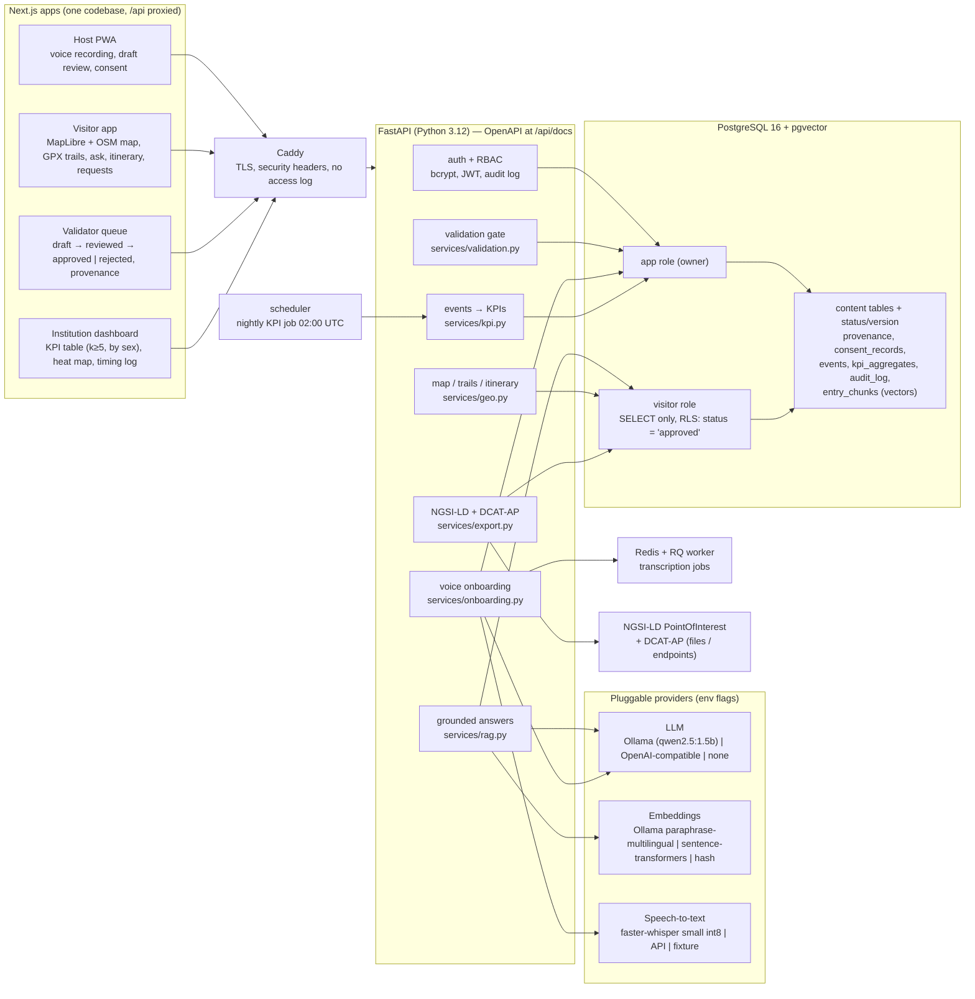
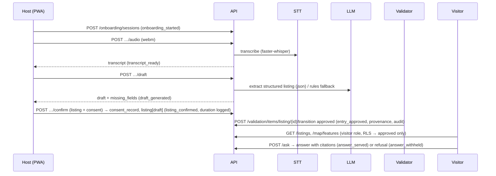

# Architecture

> Prototype built for the SMART ERA application, September–October 2026. Sample data.
> The reference documents named in the brief (`SIP_Draft_Vrmac_Living_Heritage.pdf` §2.2/§2.3/§11 and
> `VRMAC_LH_Prototype.html`) were not available in the repository when this prototype was built; the diagram
> below follows the brief's architecture description and should be aligned with §2.2 of the SIP Draft.

## Component diagram

## Workflows (one real path each)

## Data-layer enforcement of the validation gate

1. `status` CHECK constraint on every content table (`draft|reviewed|approved|rejected`), `version >= 1`.
2. Every transition writes a `provenance` row (who, when, version, source, note) and an `audit_log` row.
3. Visitor endpoints open the database as `vrmac_public`, a role with `SELECT` only and **row-level-security
   policies** `USING (status = 'approved')` on `heritage_entries`, `listings`, `trail_segments`, `trail_reports`,
   and `EXISTS(... approved)` on `entry_chunks`. A buggy query cannot leak a draft.
4. The services additionally apply an explicit `status == 'approved'` filter (belt and braces).
5. Tests in `backend/tests/test_validation_gate.py` prove all of the above against a real PostgreSQL.

## Deployment (2 vCPU / 4 GB, no GPU)

| Service | Image | Memory cap | Role |
|---|---|---|---|
| db | pgvector/pgvector:pg16 | 512 MB | content, vectors, events, aggregates |
| redis | redis:7-alpine | 64 MB | job queue |
| ollama (+ ollama-pull) | ollama/ollama | 2.2 GB | qwen2.5:1.5b + paraphrase-multilingual (CPU) |
| api | backend/Dockerfile | 1.2 GB | FastAPI + faster-whisper small (int8) |
| worker | backend/Dockerfile | 1.2 GB | RQ worker (transcription) |
| scheduler | backend/Dockerfile | 256 MB | nightly KPI computation |
| web | frontend/Dockerfile | 384 MB | Next.js (standalone) |
| caddy (profile `proxy`) | caddy:2-alpine | – | TLS termination |

Memory caps are soft guidance for a 4 GB VPS; the LLM and STT models are the small variants on purpose.
`LLM_PROVIDER=openai` with a hosted API removes the Ollama service entirely (`COMPOSE_PROFILES=` empty).
