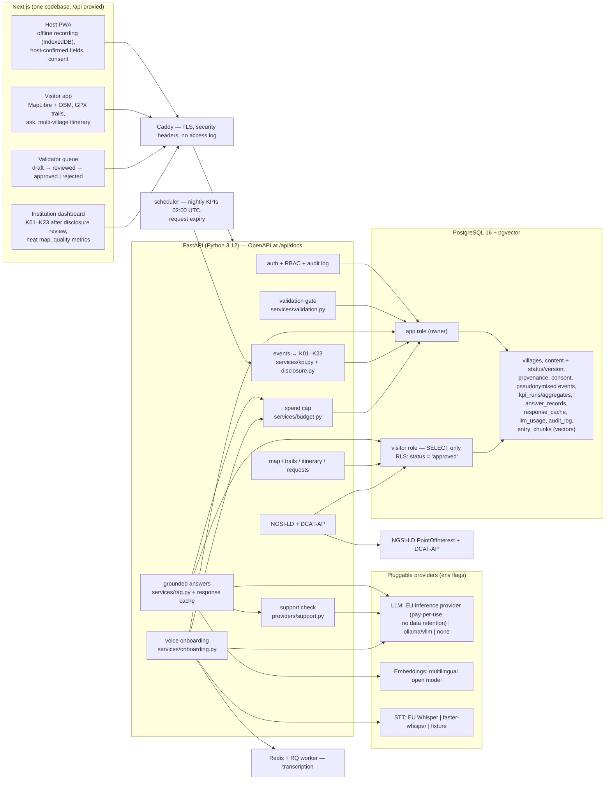
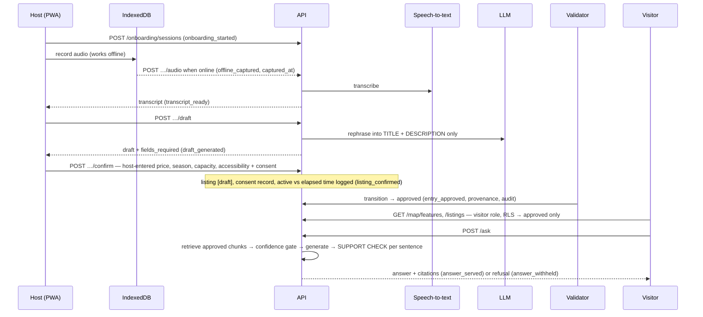

# Architecture

> Prototype built for the SMART ERA application, September–October 2026. Sample data.
> `SIP_Draft_Vrmac_Living_Heritage.pdf` §2.2/§2.3 was not available to this build, so the diagrams below
> follow the brief. Align them with the SIP Draft before the pitch (see `docs/decisions.md`).

## Territory

The prototype covers the rural plateau of Vrmac **on both sides of the ridge**. Every point of interest,
provider, trail segment and event belongs to a village, and every village carries its municipality.

| Village | Municipality | Side | Content |
|---|---|---|---|
| Gornja Lastva | Tivat | Tivat | approved: village, both churches' entries, festival, landscape days, culture house, olive mills, census |
| Donja Lastva | Tivat | Tivat | approved: settlement, sample providers, trailhead |
| St Vitus area | Tivat | ridge | approved: 9th-century church at 440 m |
| Tivat | Tivat | Tivat | approved: municipality seat |
| Gornji Stoliv | **Kotor** | Kotor | **unverified**: draft entry only, cannot be approved |
| Pasiglav | Tivat | Tivat | **unverified**: reference row only |

## Components

## Workflows

## How each guarantee is enforced

| Guarantee | Mechanism |
|---|---|
| Only approved content reaches visitors | `CHECK` constraint on status; read-only DB role with row-level security `USING (status='approved')`; explicit `approved_only` filters; `tests/test_validation_gate.py` |
| Unverified facts cannot be published | `facts_verified` flag; the gate refuses to approve; the assistant therefore withholds |
| Answers are attributable | retrieval over approved chunks + per-sentence support check; unsupported sentences dropped; empty answer → withheld |
| Never unsourced text when the budget runs out | `services/budget.guard` → cached answer or "assistant paused"; generation is the only thing that stops |
| No personal data in analytics | keyed HMAC pseudonyms for actor, session and device; no free text in events; answers stored unlinked for review |
| Nothing published below k | primary (k≥5), secondary and small-cell suppression, then a human disclosure review per run |

## Deployment (2 vCPU / 4 GB, no GPU)

| Service | Image | Memory cap | Role |
|---|---|---|---|
| db | pgvector/pgvector:pg16 | 512 MB | content, vectors, events, aggregates |
| redis | redis:7-alpine | 64 MB | job queue |
| ollama (+ pull) | ollama/ollama | 2.2 GB | demo-laptop models (skip when using the EU provider) |
| api | backend/Dockerfile | 1.2 GB | FastAPI + faster-whisper small (int8) |
| worker | backend/Dockerfile | 1.2 GB | transcription jobs |
| scheduler | backend/Dockerfile | 256 MB | nightly KPI run, request expiry |
| web | frontend/Dockerfile | 384 MB | Next.js (standalone) |
| caddy (profile `proxy`) | caddy:2-alpine | – | TLS termination |

With `LLM_PROVIDER=eu_api` and `COMPOSE_PROFILES=` the Ollama service disappears and the stack fits
comfortably in 4 GB.
